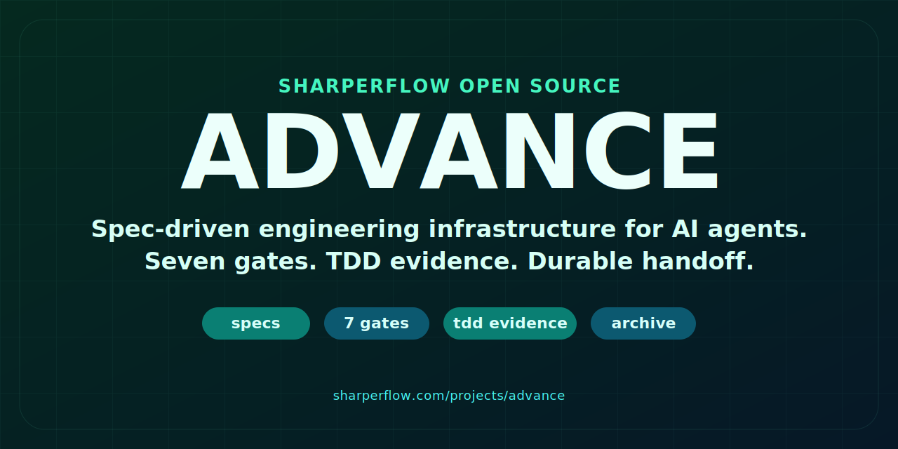

<p align="center">
  
</p>

<p align="center">
  <strong>Spec-Driven Development for AI Agents</strong>
</p>

<p align="center">
  <a href="https://github.com/Sharper-Flow/Advance/actions/workflows/ci.yml"></a>
  <a href="LICENSE"></a>
  <a href="https://www.typescriptlang.org/"></a>
</p>

ADV (Advance) is an OpenCode plugin that enables **spec-driven development** where specifications become enforceable laws. Changes to your system are formally proposed, validated against existing specs, implemented with TDD, and permanently archived.

## Why ADV?

| Challenge | ADV's Solution |
|-----------|----------------|
| **Requirements drift** | Specs are the single source of truth |
| **Incomplete implementations** | Validation gates block malformed changes |
| **No audit trail** | Every change is archived with full history |
| **Ad-hoc testing** | TDD workflow with Red/Green phase evidence |
| **Scattered docs** | Auto-generated documentation from specs |

## Quick Start

```bash
# Clone the repository
git clone https://github.com/Sharper-Flow/Advance.git
cd Advance/plugin

# Install dependencies
pnpm install

# Run tests
pnpm test
```

See [INSTALL.md](INSTALL.md) for detailed setup instructions.

## Workflow

```
/adv-proposal "Add user authentication"
       │
       ▼
┌─────────────────────────────────┐
│  DRAFT                          │
│  Define requirements & tasks    │
└──────────────┬──────────────────┘
               │
               ▼
/adv-validate {change-id}
       │
       ▼
┌─────────────────────────────────┐
│  ACTIVE                         │
│  Validation passed              │
└──────────────┬──────────────────┘
               │
               ▼
/adv-apply {change-id}
       │
       ▼
┌─────────────────────────────────┐
│  TDD LOOP                       │
│  [TDD_RED]   Write failing test │
│  [TDD_GREEN] Implement to pass  │
│  Repeat until all tasks done    │
└──────────────┬──────────────────┘
               │
               ▼
/adv-archive {change-id}
       │
       ▼
┌─────────────────────────────────┐
│  ARCHIVED                       │
│  Specs updated, docs generated  │
└─────────────────────────────────┘
```

## Commands

### Core Workflow

| Command | Description |
|---------|-------------|
| `/adv-status` | Project overview with specs, changes, and recommendations |
| `/adv-proposal <summary>` | Create a new change proposal with scaffolding |
| `/adv-validate <id>` | Validate change against specs before implementation |
| `/adv-apply <id>` | Implement change with TDD workflow |
| `/adv-archive <id>` | Archive completed change and update specs |

### Pre-Implementation

| Command | Description |
|---------|-------------|
| `/adv-clarify` | Socratic questions to uncover requirements |
| `/adv-prep <id>` | Gap analysis for missing scenarios and tasks |
| `/adv-research <target>` | Validate architectural decisions via Context7 |

### Post-Implementation

| Command | Description |
|---------|-------------|
| `/adv-review <id>` | 4-agent code review (traceability, logic, security, architecture) |
| `/adv-harden <id>` | 5-agent hardening (tests, AI-slop, docs, cleanup, spec alignment) |
| `/adv-audit [capability]` | Project-wide spec/implementation drift detection |

### Advanced

| Command | Description |
|---------|-------------|
| `/adv-ralph <id>` | Autonomous implementation with retry protocol |
| `/adv-refactor <id>` | Refresh stale proposals to match codebase |
| `/adv-coordinate` | Multi-change conflict detection |
| `/adv-roadmap` | Progress dashboard with tiered view |

## MCP Tools

ADV exposes 13 MCP tools for programmatic access:

### Spec Tools
| Tool | Description |
|------|-------------|
| `adv_spec_list` | List capabilities with optional filtering |
| `adv_spec_show` | Get full spec details |
| `adv_spec_search` | Search requirements by keyword (FTS5) |

### Change Tools
| Tool | Description |
|------|-------------|
| `adv_change_list` | List changes by status |
| `adv_change_show` | Get change details with tasks and deltas |
| `adv_change_create` | Create new change scaffold |
| `adv_change_validate` | Validate change against specs |
| `adv_change_archive` | Archive change and update specs |

### Task Tools
| Tool | Description |
|------|-------------|
| `adv_task_list` | List tasks in a change |
| `adv_task_ready` | Get tasks ready to start (unblocked) |
| `adv_task_update` | Update task status |
| `adv_task_add` | Add task to change |

### Status
| Tool | Description |
|------|-------------|
| `adv_status` | Get project overview |

## Status Markers

| Marker | Meaning |
|--------|---------|
| `[ADV:ROCKET]` | Active work in progress |
| `[ADV:TDD_RED]` | Red phase - writing failing test |
| `[ADV:TDD_GREEN]` | Green phase - implementing to pass |
| `[ADV:MOON]` | Waiting for sub-agent results |
| `[ADV:EARTH]` | Complete or awaiting input |
| `[ADV:DOOM_LOOP]` | Stuck after 3+ retries |
| `[ADV:MIC]` | Needs user approval |

## Project Structure

```
project/
├── project.json          # ADV configuration
├── .adv/                 # ADV internals
│   ├── specs/            # The Laws (capability specifications)
│   │   └── {capability}/
│   │       └── spec.json
│   ├── changes/          # Active change proposals
│   │   └── {change-id}/
│   │       ├── change.json
│   │       └── proposal.md
│   ├── archive/          # Completed changes
│   │   └── {date}-{change-id}/
│   └── db/               # SQLite cache with FTS5
│       └── spec.db
└── docs/specs/           # Generated documentation (user-facing)
    └── {capability}.md
```

## Architecture

```
┌─────────────────────────────────────────────────────────────┐
│                      AI Agent (OpenCode)                    │
└───────────────────────────┬─────────────────────────────────┘
                            │ MCP Tool Calls
                            ▼
┌─────────────────────────────────────────────────────────────┐
│                       ADV Plugin                            │
│  ┌─────────────────────────────────────────────────────┐    │
│  │                   13 MCP Tools                      │    │
│  │   spec_list  change_create  task_update  status     │    │
│  └──────────────────────┬──────────────────────────────┘    │
│                         │                                   │
│  ┌──────────────────────▼──────────────────────────────┐    │
│  │              Validation Engine                      │    │
│  │   ID checks, conflicts, completeness, references   │    │
│  └──────────────────────┬──────────────────────────────┘    │
│                         │                                   │
│  ┌──────────────────────▼──────────────────────────────┐    │
│  │                 Storage Layer                       │    │
│  │         JSON (source of truth) + SQLite FTS5       │    │
│  └─────────────────────────────────────────────────────┘    │
└─────────────────────────────────────────────────────────────┘
```

## Development

```bash
cd plugin

pnpm install      # Install dependencies
pnpm test         # Run 222 tests
pnpm run check    # Typecheck + lint + format
```

### Test Coverage

- 222 tests across 11 test files
- Storage layer (JSON, SQLite, Store)
- All 13 MCP tools
- Validation engine with error paths
- Archive operations
- Events and status detection

## Documentation

- [INSTALL.md](INSTALL.md) — Installation and setup
- [ADV_INSTRUCTIONS.md](ADV_INSTRUCTIONS.md) — Agent instructions
- [CHANGELOG.md](CHANGELOG.md) — Version history
- [COMMAND_REPORT.html](COMMAND_REPORT.html) — Detailed command documentation

## Related Projects

- [Goost](https://github.com/anomalyco/goost) — Contract-based task persistence (complementary)
- [OpenCode](https://github.com/anomalyco/opencode) — AI coding CLI

## License

MIT

---

<sub>Built with TypeScript. Specs become laws.</sub>
