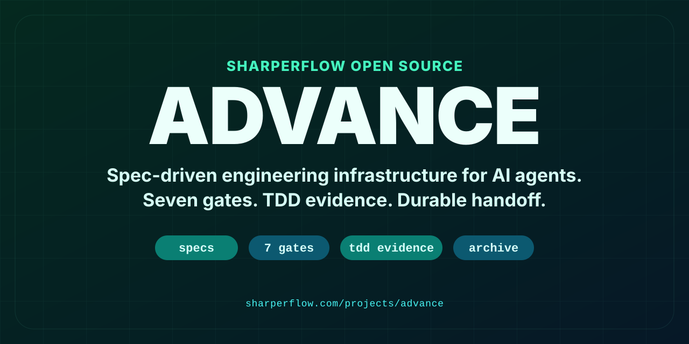

<h1 align="center">Advance</h1>

<p align="center">
  <strong>Spec-driven engineering infrastructure for AI-assisted development.</strong><br>
</p>

<p align="center">
  <a href="https://sharperflow.com/projects/advance">
    
  </a>
</p>

<p align="center">
  <a href="https://github.com/Sharper-Flow/Advance/actions"></a>
  <a href="#license"></a>
  <a href="https://github.com/Sharper-Flow/Advance"></a>
</p>

<p align="center">
  <a href="https://sharperflow.com/projects/advance">Project Page</a>
  &middot;
  <a href="https://github.com/Sharper-Flow/Advance">GitHub</a>
  &middot;
  <a href="CHANGELOG.md">Changelog</a>
  &middot;
  <a href="SETUP.md">Setup</a>
</p>

---

> [!NOTE]
> Advance targets OpenCode. 

## What Advance is

Advance is an [OpenCode](https://github.com/anomalyco/opencode) plugin that turns AI coding into a governed engineering system.

It combines:

- **Spec law** — durable capability requirements in `.adv/specs/`
- **7-gate delivery** — proposal → discovery → design → planning → execution → acceptance → release
- **Disk-backed persistence** — transactional change/task/gate projections that survive process and context loss
- **MCP tool surface** — structured state mutation and inspection, not hidden chat memory
- **Context engineering** — one coherent orchestrator, focused sub-agent packets for deep work
- **TDD evidence capture** — red/green proof recorded on tasks
- **Worktree isolation** — branch-local specs, shared external change state, safe parallel implementation
- **Task checkpoint commits** — local rollback/audit commits before task completion
- **Review + hardening loops** — explicit correctness, security, architecture, test, and slop checks
- **Wisdom accumulation** — reusable project learnings promoted from completed work
- **Runtime guardrails** — bash safety, sub-agent nesting limits, cancellation policy, doom-loop detection
- **External conformance hooks** — optional black-box CI verification for spec drift

The result: AI agents can move fast without losing the engineering contract.

## Why it exists

AI coding tools are powerful, but raw chat has weak guarantees:

| Failure mode       | What usually happens                                |
| ------------------ | --------------------------------------------------- |
| Scope drift        | “Add OAuth” becomes unrelated refactors             |
| Context loss       | Compaction or new sessions drop critical decisions  |
| Fake verification  | “Tests pass” means no evidence was captured         |
| Shallow review     | Generic comments replace systematic review          |
| Infinite retries   | Agents repeat failing strategies without escalation |
| Half-finished work | No archive, no spec update, no durable handoff      |

Advance treats these as infrastructure problems, not prompt problems.

## Why Advance is different

Many tools solve one slice of this problem. Some provide durable workflows. Some enforce test commands. Some add memory. Some add review bots. Some add task plans.

Advance is different because it balances all of those parts in one loop.

The efficiency comes from **context engineering**. The user works with one primary `adv` agent that carries the full change contract. Deeper work is shed to sequential, bounded sub-agents with their own focused instructions, tool access, and output schemas. The orchestrator keeps the state, gates, user checkpoints, and final decisions.

That is the harness engineering layer: not a bigger prompt, but a stronger operating harness around the agent.

| Single-aspect approach               | What it helps with             | What it still misses                                              | Advance adds                                                         |
| ------------------------------------ | ------------------------------ | ----------------------------------------------------------------- | -------------------------------------------------------------------- |
| Durable state stores             | Process survival               | Requirements, review, TDD proof, acceptance, archive              | Disk projections bound to specs, gates, tasks, and evidence          |
| Prompt checklists                    | Agent behavior hints           | Enforcement, persistence, machine-readable state                  | MCP tools, gate state, validators, guardrails                        |
| Test runners                         | Verification command execution | Scope control, red/green audit trail, design agreement            | Per-task TDD evidence plus change contract                           |
| Memory layers                        | Session continuity             | Acceptance criteria, release governance, conflict detection       | External change state, wisdom, agenda, context snapshots             |
| Review bots                          | Post-hoc feedback              | Planning, implementation discipline, archival closure             | Review and harden as first-class gates                               |
| Task managers                        | Work breakdown                 | Spec conformance, retries, checkpointing, cross-session execution | Task graph tied to specs, worktrees, evidence, commits               |

Advance does not claim one mechanism is enough. It makes the mechanisms cooperate:

```text
specs define truth
gates define lifecycle
disk projections preserve state
MCP tools expose state
tasks carry evidence
worktrees isolate change
checkpoints preserve rollback
review/harden catch drift
archive promotes learnings back into law
```

That combination is the product.

## Inspirations and how Advance extends them

Advance is an original implementation, but it is not an isolated idea. It owes a lot to projects that made agentic engineering more structured, durable, and spec-driven.

| Inspo tool                                                          | Technique / idea                                                                                        | Upgrade with Advance                                                                                                                         |
| ------------------------------------------------------------------- | ------------------------------------------------------------------------------------------------------- | -------------------------------------------------------------------------------------------------------------------------------------------- |
| [Beads](https://github.com/steveyegge/beads)                        | Agent-friendly task memory, dependency graphs, ready-task discovery, structured issue state.            | Binds tasks to gates, contracts, TDD evidence, checkpoint commits, worktrees, and crash-safe disk recovery.                                 |
| [Spec Kit](https://github.com/github/spec-kit)                      | Spec-driven flow: define, plan, task, implement.                                                        | Adds durable gates, user checkpoints, MCP tools, contract review matrices, spec promotion, and release governance.                           |
| [OpenSpec](https://github.com/Fission-AI/OpenSpec)                  | Proposal/change folders, agreed-before-build behavior, deltas, design notes, archive-as-spec-promotion. | Makes the lifecycle stateful and auditable with disk projections, artifact readiness, shared ADV state, review, harden, and release controls. |
| [OpenCode](https://github.com/anomalyco/opencode)                   | Local agent host, plugins, slash commands, sub-agents, tool-mediated development.                       | Adds context engineering: one primary orchestrator, bounded sub-agents, structured tools, gate contracts, and evidence capture.              |
| [opencode-worktree](https://github.com/kdcokenny/opencode-worktree) | Isolated OpenCode agent worktrees with terminal spawning, sync, and cleanup.                            | Makes worktrees part of the delivery contract: gate ownership, disk state, task checkpoints, branch-local specs, and safe archive merge.     |

The pattern is deliberate: take strong primitives from each predecessor, then vertically integrate them into one enforceable agent harness.

## Unique technical stack

Advance is intentionally unusual. It is not just commands around an LLM.

| Layer                 | Technology / system                                 | Why it matters                                                                     |
| --------------------- | --------------------------------------------------- | ---------------------------------------------------------------------------------- |
| Host                  | OpenCode plugin                                     | Runs where coding agents already work                                              |
| Runtime               | Bun host + Node tooling                            | Matches the OpenCode runtime and the plugin's build/test requirements              |
| Persistence           | JSON disk projections + transactional file locks  | Recovers task/change state across crashes, compaction, and long-running work       |
| Context engineering   | Primary orchestrator + bounded sub-agent packets    | Keeps user interaction coherent while shedding deep work to focused workers        |
| Tool API              | MCP-style ADV tools                                 | State changes are explicit, typed, inspectable, and auditable                      |
| Contracts             | `.adv/specs/` + proposal/agreement/design artifacts | Requirements become durable law, not chat context                                  |
| Validation            | Zod v4 schemas + spec validators                    | Tool inputs and change state stay structured                                       |
| Workflow UX           | Slash commands + gate contracts                     | Humans approve the right checkpoints; agents run autonomous phases                 |
| Methodology reuse     | Skills                                              | Discovery, prep, review, harden, slop detection, and cost governance stay reusable |
| Specialist execution  | Bounded sub-agents                                  | Research and implementation can be delegated without recursive agent sprawl        |
| Isolation             | Git worktrees                                       | Implementation can happen away from the main checkout while sharing ADV state      |
| Evidence              | TDD logs + task checkpoints                         | “Done” means auditable proof exists                                                |
| Learning loop         | Wisdom + reflection                                 | Successful patterns and gotchas survive the change that produced them              |
| Safety                | Bash guard, task nesting guard, doom-loop detection | Agent autonomy has hard limits                                                     |
| Conformance           | External CI verdict ingestion                       | Specs can be checked by black-box tests outside the agent’s reach                  |

This is why Advance is more than durable functions, more than a memory layer, more than a prompt pack, and more than a test wrapper.

## Core workflow


Every phase produces artifacts that later phases can verify.

## The 7 gates

| Gate       | Purpose                                           | Human role                                                        |
| ---------- | ------------------------------------------------- | ----------------------------------------------------------------- |
| Proposal   | Clarify problem, scope, user outcomes             | Confirm problem statement                                         |
| Discovery  | Gather evidence and define agreement              | Approve objectives and acceptance criteria                        |
| Design     | Validate architecture and implementation strategy | Approve only when tradeoffs need judgment or validation conflicts |
| Planning   | Build task graph and flight-check readiness       | Explicit prep approval                                            |
| Execution  | Implement tasks with TDD, retries, checkpoints    | Autonomous unless blocked                                         |
| Acceptance | Review delivered work against agreement           | Confirm delivered result                                          |
| Release    | Harden, archive, reflect, finalize                | Sign off archive                                                  |

No gate is a vibe check. Each gate has a contract.

## What “done” means

Advance narrows “done” to evidence:

- Agreement exists and acceptance criteria are explicit.
- Design has been validated before implementation.
- Tasks are tracked and blocked dependencies are known.
- TDD evidence exists where applicable.
- Changed work is checkpointed before task completion.
- Review and hardening findings are fixed or classified out of scope.
- Specs are updated when behavior becomes law.
- Wisdom and reflection are recorded for the next change.

## Key capabilities

### Spec-driven changes

Specs are laws. Proposals and implementations can evolve, but archive validates against the current spec contract. When behavior changes permanently, archive applies spec deltas.

### Durable task state

Disk projections track changes, task runs, gates, evidence, and recovery state. If an agent session dies or compacts, the next session resumes from durable files instead of reconstructing intent from chat. Each change projection is updated under a per-change advisory lock with read-latest-inside-lock, atomic temp-write/rename/fsync, in-lock readback, and revision/operation-identity verification.

### TDD evidence, not test theater

For implementation tasks, Advance records red and green phases with command, output, test file, and exit code. If TDD is not applicable, the task must say why.

### Checkpoint commits

Every `/adv-apply` task with file changes creates a local checkpoint through `adv_task_checkpoint` before it is marked done. Checkpoints include change ID, task ID, mode, and verification summary.

### Worktree-aware execution

Mutating work runs in per-change worktrees. ADV state is external and shared across worktrees; specs remain git-tracked and branch-local. That gives isolation without losing coordination.

> [!TIP]
> Use worktrees for any agent run that will edit files. Advance materializes or resumes a `change/<change-id>` worktree, routes mutating tools there, and leaves the main checkout available for review, merge, and release. This pattern is inspired by [opencode-worktree](https://github.com/kdcokenny/opencode-worktree), which showed how worktrees make OpenCode agent sessions safer and easier to parallelize. Advance adds gate ownership, shared disk projections, task checkpoints, branch-local specs, and archive finalization.

### Bounded autonomy

Advance lets agents work autonomously only inside approved boundaries. It stops for human checkpoints, design conflicts, doom loops, cancellation approval, archive sign-off, and scope drift that changes the agreement.

### Accumulated wisdom

Patterns, successes, failures, conventions, and gotchas can be recorded per change and promoted to project-level wisdom. The system gets better as it ships.

### External conformance

Optional CI-isolated conformance checks can verify specs from outside the agent’s editable context. Drift blocks archive unless a human explicitly unlocks or overrides.

### Prioritizer protocol

When 2+ viable approaches depend on user values, Advance runs the prioritizer before asking. The protocol runs inline by default: it researches tradeoffs, drafts criteria questions, and surfaces a concise choice through the orchestrator. Delegated sub-agents use the same protocol for task-level decisions.

## Command + skill architecture

Advance separates workflow ownership from reusable methodology.

- **Commands** own user entry points, gate transitions, state mutation, and artifacts.
- **Skills** own reusable guidance and checklists.
- **Sub-agents** handle bounded research, validation, and implementation work when context can be safely shed.
- **The ADV orchestrator** keeps sequencing, approvals, and state consistent.

The sub-agent system still exists: `adv-engineer` implements backend/state/API work, `adv-designer` is the apply-phase frontend/component specialist (write-only, never review/harden owner), `adv-researcher` validates architecture/docs/examples, `adv-reviewer` remediates review/harden findings (with a `FRONTEND DESIGN REVIEW SKILL` anchor for design-inclusive changes), and `explore` scans code. They are context-engineering tools, not owners of the lifecycle.

This also enables model comparison: run the same change on two models and compare outputs. Gates, specs, tools, and evidence stay identical; only the reasoning varies.

## Command reference

| Command          | Description                                                                                          |
| ---------------- | ---------------------------------------------------------------------------------------------------- |
| `/adv-status`    | Show fast ADV status table                                                                           |
| `/adv-idea`      | Explore rough ideas before drafting a proposal                                                       |
| `/adv-problem`   | Triage defects and unintended behavior before fixing or drafting a proposal                          |
| `/adv-epic`      | Gather Epic goals before typed creation                                                             |
| `/adv-backlog`   | Capture future work before it becomes an Epic or change                                              |
| `/adv-proposal`  | Extract problem statement, user outcomes, and constraints without creating tasks                     |
| `/adv-discover`  | Gather context, analyze current state, identify objectives, and obtain user agreement                |
| `/adv-design`    | Validate architecture decisions, produce implementation strategy, and present design for user review |
| `/adv-prep`      | Analyze gaps and synthesize tasks from approved agreement plus validated design                      |
| `/adv-apply`     | Implement change with TDD, retry on failure, and final verification                                  |
| `/adv-review`    | Review code for correctness, security, and architecture; emit REVIEW_FINDINGS                        |
| `/adv-harden`    | Detect low-quality code, verify test coverage, clean up; block archive on open findings              |
| `/adv-archive`   | Archive completed change: apply spec deltas and finalize git                                         |
| `/adv-validate`  | Validate change compliance against specs; block archive on failure                                   |
| `/adv-clarify`   | Ask clarifying questions to resolve ambiguous requirements                                           |
| `/adv-research`  | Produce a defined, fully-researched proposed plan ready for user approval                            |
| `/adv-task`      | Fast-track small changes: assess spec-law impact, prep, and hand off                                 |
| `/adv-audit`     | Detect drift between specs and current implementation                                                |
| `/adv-slop-scan` | Scan slop, deletion safety, and detector coverage                                                    |
| `/adv-arch-scan` | Scan architecture stack packs, coverage, and heuristic fallbacks                                     |
| `/adv-comp-scan` | Scan competitor capabilities against this project for competitive intelligence                       |
| `/adv-refactor`  | Refresh a stale proposal or batch-refresh the oldest 30% of active changes                           |
| `/adv-cleanup`   | Triage stale changes, drifted worktrees, merged branches, and state leaks; delete approved candidates |
| `/adv-coordinate` | Audit project changes, Epic alignment, sequencing, and membership health; includes Epic-unlinked in-flight changes                          |
| `/adv-triage`    | Triage sources, coalesce issue links, assign bug priority, and balance portfolio |
| `/adv-improve`   | Analyze improvements across existing specs, implementation, and external landscape                    |
| `/adv-tron`      | Investigate codebase structure, hotspots, risks, and suggest follow-up candidates             |
| `/adv-optimizer` | Analyze code simplification opportunities and propose optimizer changes                              |
| `/adv-reflect`   | Produce a structured two-plane reflection report for an archived change                              |

## Quick start

### Install into OpenCode

```bash
curl -fsSL https://github.com/Sharper-Flow/Advance/releases/latest/download/install.sh | bash
```

That downloads the latest GitHub Release artifact, verifies `SHA256SUMS.txt`, and syncs the plugin, commands, overlays, bundled agents, and skills into the local OpenCode setup.

For pinned versions and source-checkout maintainer setup, see [`SETUP.md`](SETUP.md).

Then, inside an OpenCode project:

```text
/adv-proposal add OAuth login without breaking existing session flows
```

Advance will move the change through discovery, agreement, design, planning, implementation, review, hardening, and archive.

For setup details and troubleshooting, see [`SETUP.md`](SETUP.md).

## Develop the plugin

All buildable code lives in [`plugin/`](plugin/). Run commands from that directory.

```bash
cd plugin
pnpm install
pnpm test
pnpm run check
pnpm run build
```

Requires Node.js 24+ and pnpm 11.9.0. CI runs SDK parity, schema-drift, type, lint, format, unit tests, Bun CLI tests, and build checks on Node 24.x.

## Runtime model

OpenCode runs on Bun, while the plugin's build and test tooling runs on Node. No external database, server, worker, CLI service, or runtime environment variables are required.

Mutable state is stored in per-project disk projections under `~/.local/share/opencode/plugins/advance/<projectId>/`. A change lives at `changes/<changeId>/change.json` as `{schemaVersion:2,state:{...}}`. Different changes do not block one another; writes for the same change serialize through a 15-second advisory file lock with jittered backoff and stale-PID reclaim. Commits use atomic temp-write/rename/fsync, in-lock readback, and revision/operation-identity proofs, failing closed as `operator_required` on any problem. Epic state uses `active-epics/<epicId>/active-projection.json` with expected-version optimistic concurrency.

## Repository map

```text
plugin/              TypeScript OpenCode plugin implementation
  src/tools/         MCP tool implementations
  src/storage/       disk projections, transactional writes, locks, and state helpers
  src/validator/     spec validation, prep readiness, task classification
  src/events/        terminal UI/status helpers
  src/utils/         project IDs, debug logs, context snapshots, safe helpers
  schemas/           schema anchor stubs; Zod types are authoritative
.adv/specs/          git-tracked capability specs
.opencode/command/   slash-command workflow contracts
.opencode/agents/    bundled/repo-local ADV agents and overlays
skills/              reusable methodology skills
docs/                 gates, checklists, design notes, and specs
scripts/             sync, migration, maintenance, blind-test helpers
```

## Documentation map

| Document                                                 | Purpose                                                      |
| -------------------------------------------------------- | ------------------------------------------------------------ |
| [`SETUP.md`](SETUP.md)                                   | Installation, project setup, troubleshooting                 |
| [`ADV_INSTRUCTIONS.md`](ADV_INSTRUCTIONS.md)             | Full ADV operating protocol                                  |
| [`AGENTS.md`](AGENTS.md)                                 | Contributor quick-reference: architecture, commands, gotchas |
| [`docs/adv-gates.md`](docs/adv-gates.md)                 | Gate contracts and sequencing                                |
| [`docs/checklists/`](docs/checklists/)                   | Prep, review, and harden checklists                          |
| [`docs/specs/`](docs/specs/)                             | Generated/spec-facing documentation                          |

## License

The package metadata declares the MIT license.
